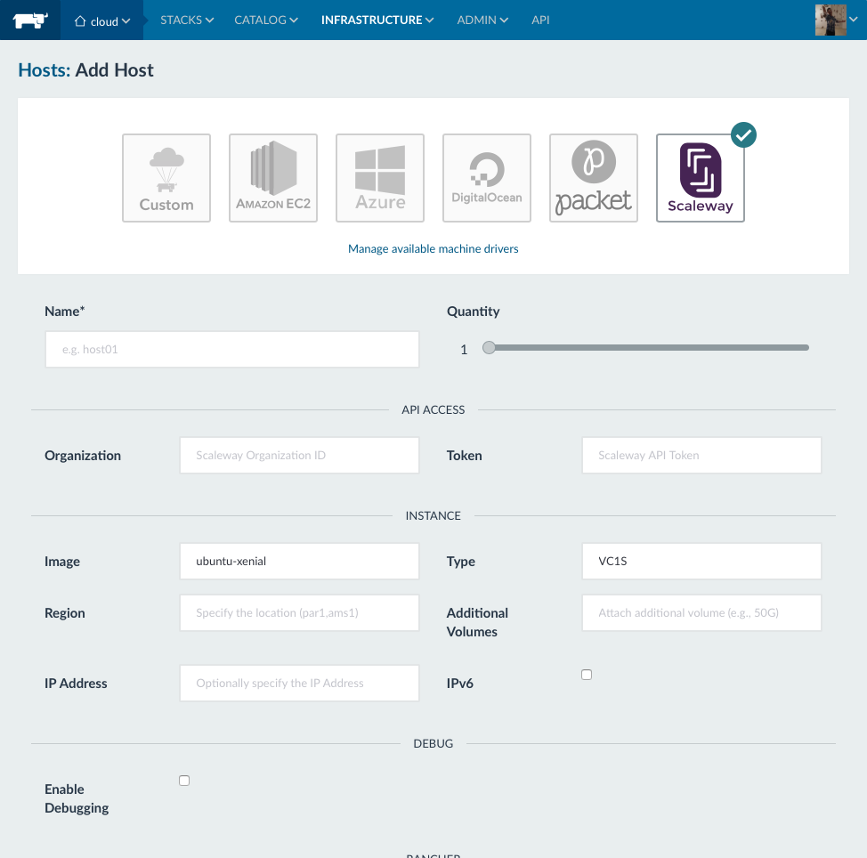

# Rancher UI for Scaleway Docker-Machine Driver
This is a Rancher UI for the scaleway docker-machine driver. This is unofficial and by no means implies any affiliation with Scaleway, I just wanted my Rancher UI to be a little prettier.

## Setup, Development, Build
Follow the guide in the Rancher repository [ui-driver-skel](https://github.com/rancher/ui-driver-skel) to prepare a build environment.

The package.json has been customised with the following additional script functions:

* `deploy`: Pushes a release from the dist subdirectory.

In practice after making changes the following steps will generate a release:

1. `npm run build`
2. `npm run deploy`

## Usage
A release is published to the [GitHub Project Page](https://mitcdh.github.io/ui-driver-scaleway/) for this repository:

1. Add a Machine Driver in Rancher (Admin tab -> Settings -> Machine Drivers)
  * Download URL: The URL for the `linux_amd64.tar.gz` driver binary from [https://github.com/scaleway/docker-machine-driver-scaleway/releases](https://github.com/scaleway/docker-machine-driver-scaleway/releases)
  * Custom UI URL: [https://mitcdh.github.io/ui-driver-scaleway/dist/component.js](https://mitcdh.github.io/ui-driver-scaleway/dist/component.js)
2. Wait for the driver to become "Active"
3. In Rancher go to (Infrastructure -> Hosts -> Add Host) and the Scaleway driver and custom UI should show up.

## Alternative UI URLs
These are just for reference as an alternative if there is a problem with GH Pages. Rancher seems to require a correct Content-Type for the .svg logo so directly accessing the raw files on github will not work as intended.

* [https://cdn.rawgit.com/mitcdh/ui-driver-scaleway/master/dist/component.js](https://cdn.rawgit.com/mitcdh/ui-driver-scaleway/master/dist/component.js)

## Credits
* [scaleway/docker-machine-driver-scaleway](https://github.com/scaleway/docker-machine-driver-scaleway)
* [rancher/ui-driver-skel](https://github.com/rancher/ui-driver-skel)
